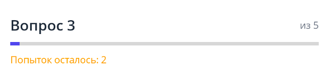
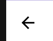
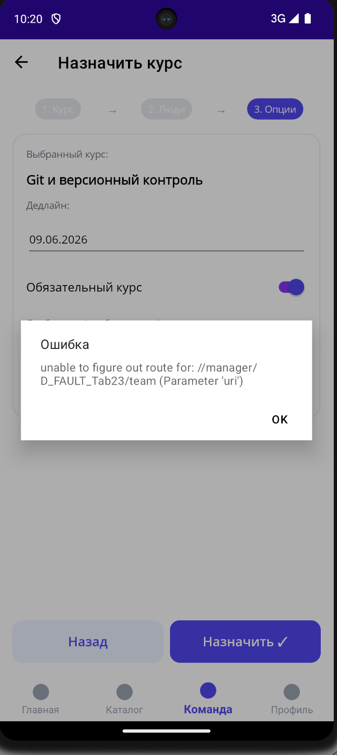
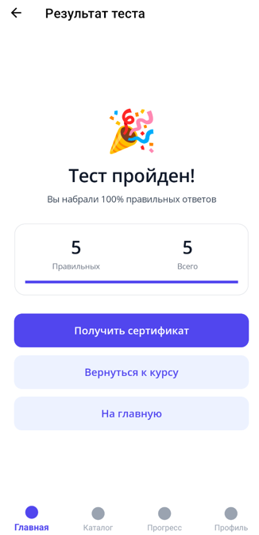
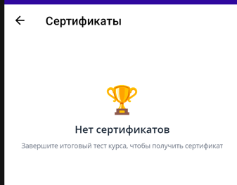
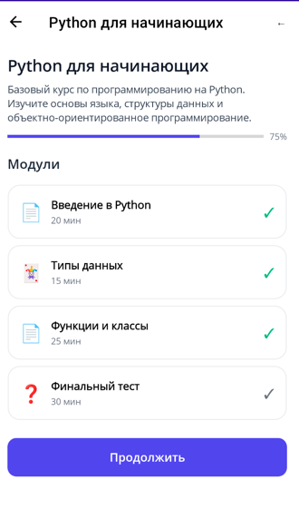

Общие пожелания:
- если несколько раз нажать на раздел в нижнем меню, то пользователя переносит на стартовую страницу раздела

- кнопка "Назад" на эмуляторе телефона не возвращает на предыдущую страницу (обязательно проверь работоспособность для всех ролей)
- в тестах внутри курсов для вопросов, в которых предполагается только один вариаент ответа варианты ответа необходимо помечать radio button, в вопросах с выбором множества ответов  варианты ответа должны быть как checkbox
- в тестах, только в ситуации после того, как дан ответ на вопрос появляется две кнопки - "Далее" и "Следующий" - должна появляться только кнопка "Далее"
- в тестах не изменяется прогресс бар вне зависимости от того, на сколько вопросов был дан ответ

- после теста кнопка "Получить сертификат"
- в приложении есть упоминания о сертификатах и рейтинге. Как посмотреть эти страницы

## Роль Администратор
Не работает кнопка стрелка назад. Ожидаемое поведение - возвращает назад

После фикса обязательно проверь работоспособность для всех ролей

## Роль Менеджер
1) Воспроизводится дефект: "Прогресс" страницы сохраняется между пользователями - я зашел в аккаунт Администратора и перешел на курс Введение в Agile. Затем вышел с аккаунта и перешел в аккаунт Менеджера. Как только я переключился во вкладку "каталог" - я оказался в том же месте, откуда вышел Администратором.
Должно быть так: Каждый раз когда сотрудник входит в аккаунт и открывает один из разделов "Главная", "Каталог", "Команда", "Профиль" должна показываться главная страница вкладки
2) Не работает кнопка стрелка назад. Ожидаемое поведение - возвращает назад (дефект аналогичен дефекту для роли Администратор)
3) При назначении курса сотруднику возникает ошибка

## Общие дефекты
Я прошел итоговый тест

При нажатии на кнопку "Получить сертификат" получаю сообщение, что тест не пройден

Сам тест не засчитался пройденным

Если ты не понял что-то в моем описании - не гадай, задавай вопросы пока не будешь на 100% уверенным в том, что я хочу

