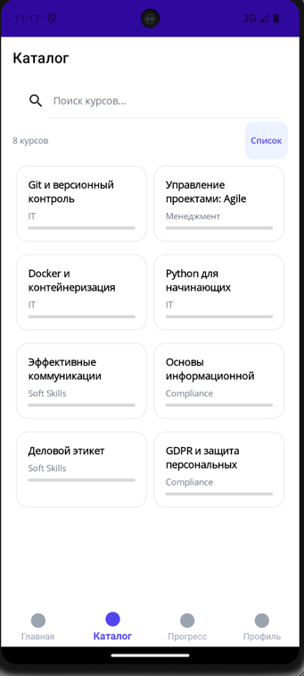
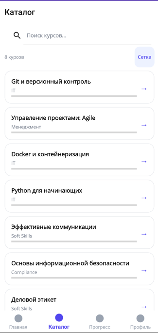
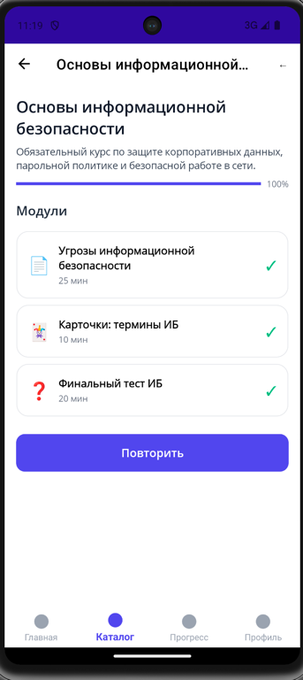
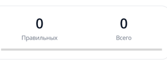
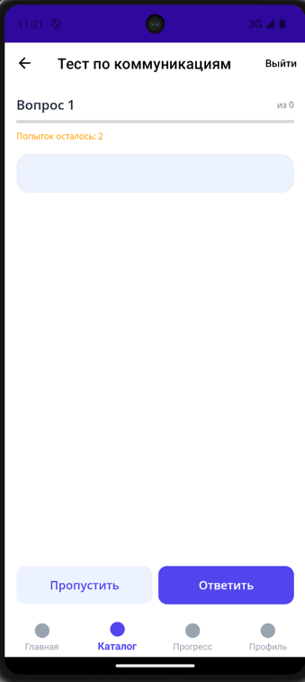
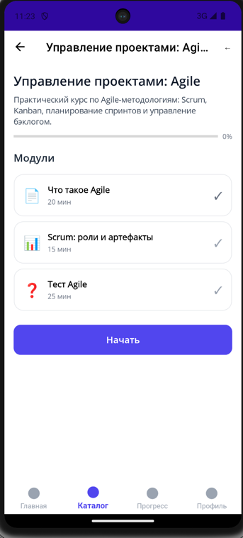
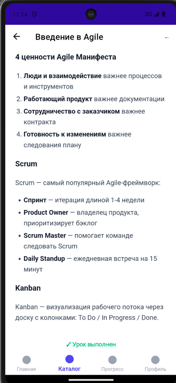
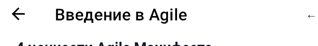
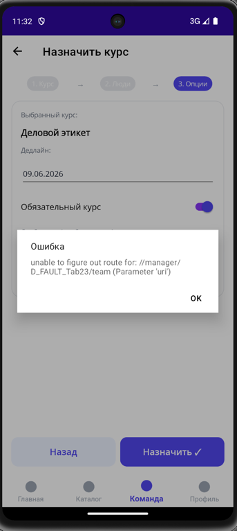

## Требование 1. Раздел Профиль -> Рейтинг
AS IS При нажатии на кнопки "Команда" и "Компания", кнопка "Компания" всегда помечается активной

TO BE Активная кнопка меняется в зависимости от выбранного раздела

## Требование 2. Раздел Профиль
- Убери Конфиденциональность - возможность выбирать "Анонимно в рейтинге" и всю связанную функциональность
- Вместо того, чтобы писать имя пользователя в аватарке - используй стандартную картинку профиля

## Требование 3. Прохождение курсов
1) Убери ограничение на количество попыток для прохождение тестирования
2) В режиме сетки и в режиме списка неверно отображается прогресс прохождения курса

при этом курс Основы информационной безопасности отмечен как выполненный, если перейти во вкладку курса

Отсюда делаю вывод, что прогресс прохождения отображается неверно

3) В курсе не должна быть возможность создавать тесты с 0 вопросов

4) Страница курса должна всегда показывать актуальный статус прохождения модуля пользователем
Для роли Сотрудник выявлен баг:
На странице курса отображается 0 пройденных модулей

Но если я захожу на модуль, который отображается как невыполненный, то вижу сообщение, что урок выполнен

5) Во все пустые тесты надо добавить хотя бы 1 вопрос

## Требование 4. Верхнее меню
Ты проигнорировал это требование уже несколько раз. Я запрещаю тебе игнорировать его.
Стрелка на верхнем меню ОБЯЗАТЕЛЬНО должна возвращать назад. Сейчас это не работает

Данная проблема была выявлена для учетных записей
- HR-менеджер
- Менеджер
- Администратор
Не помечай это требование как выполненное, пока не убедишься, что для каждой из ролей выше оно не было исправлено

## Требование 5. Назначение курсов

Ты проигнорировал это требование уже несколько раз. Я запрещаю тебе игнорировать его.
ПРИ НАЗНАЧЕНИИ КУРСА НИКОГДА НЕ ДОЛЖНА ПОЯВЛЯТЬСЯ ОШИБКА. Если данного пользователя / курса не существует - возвращай моковую запись
В текущей реализации возникает ошибка

Данная проблема была выявлена для учетных записей
- Менеджер
Не помечай это требование как выполненное, пока не убедишься, что для каждой из ролей выше оно не было исправлено